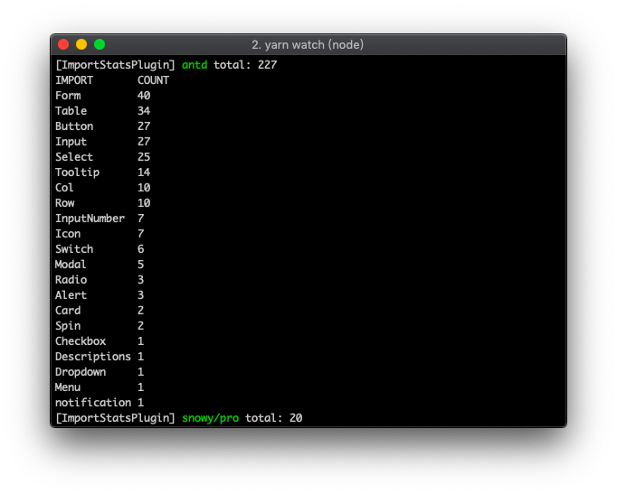

# import-stats-webpack-plugin

Print the import-statement counts of the target package. It would be useful to track the refactor progress of immense libraries.

## Install

> yarn add --dev import-stats-webpack-plugin

## Usage

webpack.config.js
```
const ImportStatsPlugin = require('import-stats-webpack-plugin');

module.exports = {
  // ...
  plugins: [
    new ImportStatsPlugin({ imports: ['antd'] })
  ]
}
```

### Options

| name    | type     | default| description |
|---------|----------|--------|-------------|
| imports | string[] | []     | target libraries |

### Output

